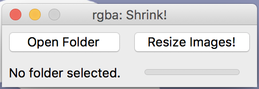

# rgba
rgba is a collection of GUI projects written in Python revolving around colors and images :D

To run each respective program in bash, navigate to the directory of where the program file is and run using python3:
```
$ python3 (insert file name).py
```

### rgba: Color Palette! ###


*Color Palette!* accepts JPEG/PNG images with at least 3 color channels (RGB or RGBA mode) :-)

[Download it! (color_palette.py)](color_palette.py)

**Python libraries used:**
- Tkinter
- Pillow (PIL)
- requests
- io
- copy


### rgba: Background! ###


*Background!* accepts PNG images with transparent backgrounds/areas  and replaces those transparent pixels with your choice of color :-)

[Download it! (background.py)](background.py)

When an image is selected (from file or from URL), the image will be displayed with white replacing the transparent areas. For example, using [this image](https://upload.wikimedia.org/wikipedia/commons/thumb/7/71/ChoughsDiff.svg/1200px-ChoughsDiff.svg.png), it will be displayed as:


This is only for initial display purposes and any color that the user picks as the background color will be reflected on the GUI. <br/>Unless, the user selects white as the background color. Then, the displayed image will look like it didn't update the background color but when it is exported (saved) and viewed on another image viewer, the image will have it's transparent regions replaced with white).

**Python libraries used:**
- Tkinter
- Pillow (PIL)
- requests
- io

### rgba: Shrink! ###


*Shrink!* accepts a folder containing JPEG and/or PNG images for image downsizing by a relative percentage. When a resize percentage is entered by the user, the progress bar in the bottom right of the GUI will update accordingly!

[Download it! (shrink.py)](shrink.py)

**Known issue(s)**:
- images with color profiles do not preserve any color profiles upon downsizing and saving which may affect colors on the resized image

**Python libraries used:**
- Tkinter
- Pillow (PIL)
- os
- glob
# Acknowledgements #
Thanks to:
- shuuji3 on [this stackoverflow question](https://stackoverflow.com/questions/9166400/) for how to replace transparent parts of an image with white (in fact, any other color too)! :D
