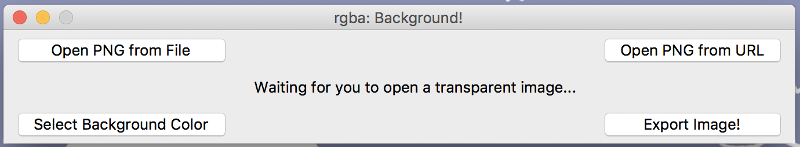

# rgba
rgba is a collection of GUI projects made in Python revolving around colors and images :D

## rgba: Color Palette! ##

 <i>Color Palette!</i> accepts JPEG/PNG images with at least 3 color channels (RGB or RGBA mode) :-)

Python libraries used:

- Tkinter
- Pillow (PIL)
- requests
- io
- copy

## rgba: Background! ##

 <i>Background!</i> accepts PNG images with transparent backgrounds/areas  and replaces those transparent pixels with your choice of color :-)

When an image is selected (from file or from URL), the image will be displayed with white replacing the transparent areas. For example, using [this image](https://upload.wikimedia.org/wikipedia/commons/thumb/7/71/ChoughsDiff.svg/1200px-ChoughsDiff.svg.png), it will be displayed as:

 This is only for initial display purposes and any color that the user picks as the background color will be reflected on the GUI.  Unless, the user selects white as the background color. Then, the displayed image will look like it didn't update the background color but when it is exported (saved) and viewed on another image viewer, the image will have it's transparent regions replaced with white).

Python libraries used:

- Tkinter
- Pillow (PIL)
- requests
- io

## rgba: Crop! ##
WIP
## Acknowledgements ##
Thanks to:

